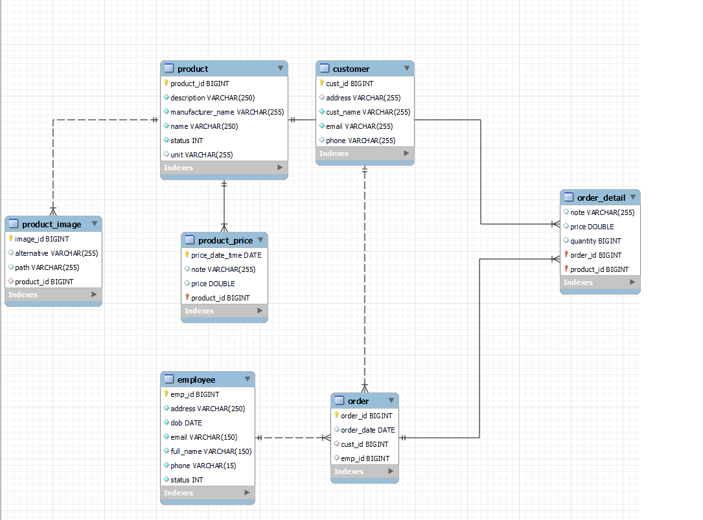
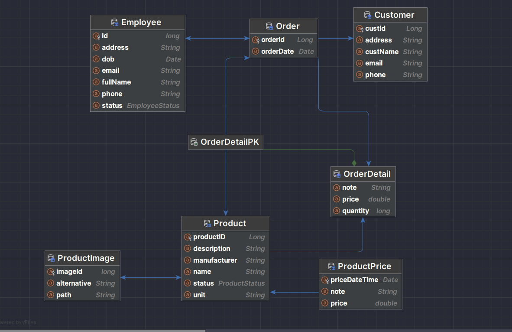
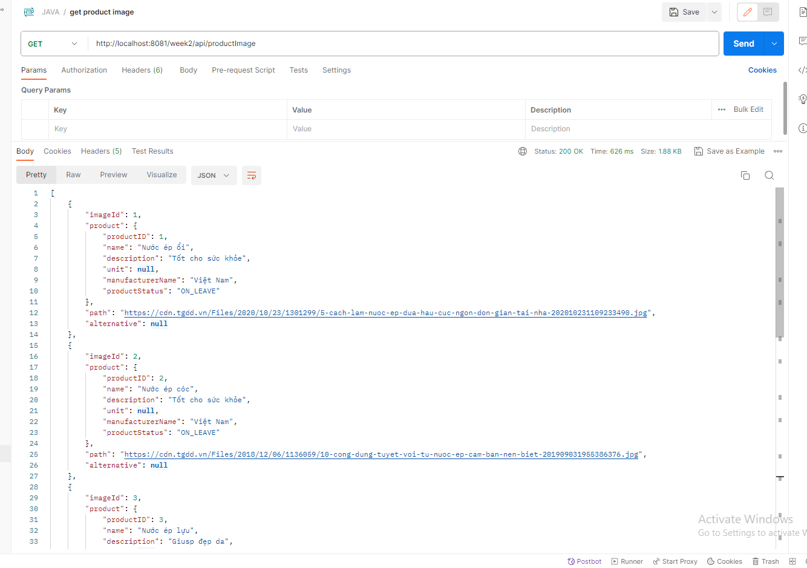

# WWW_WEEK02 (REST API)
JAVA HIBERNATE 
# Database diagram

# Class diagram

# Database
- Can use mySQL, Mariadb,...
# How to run Backend
 - Step 1: Clone code 
 - Step 2: You have to config file: hibernate.cfg.xml and add libs in build.gradle.
 - Step 3: Run class main to generate database (Run into MySessionFactory.java).
 - Step 4: You can import sample data in file: database_week02.sql to test.
 - Step 5: Test api in postman (ex: http://localhost:8081/week2/api/productImage)

# Business rule for admin (employees in shop)
 1 Employee
  - List employee

  - Insert employee

2 Customer
  - List customer

  - Filter customer (ex: by name)

  - Insert customer

3 Order
- List order

- Admin insert order

Insert success 

- Order detail!

- Report order by date

# Business rule for customer when shopping online
- Can see all list product

Filter product by unit

See detail product

Customer can search or filter product by name, price

- Before customer can add product to cart, user have to login (If not exist account, they can register)

Customer can update information

- Add product to cart

- Payment

